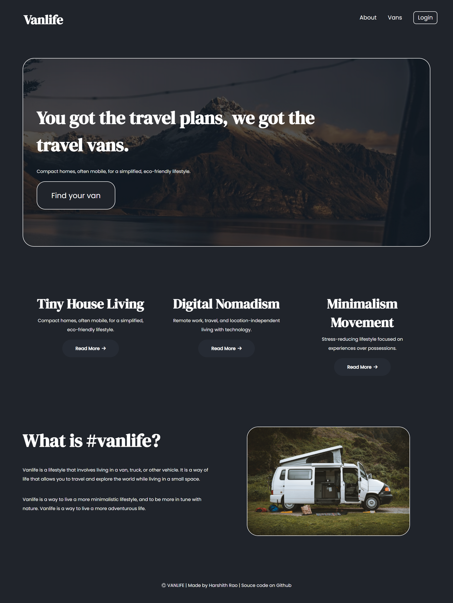
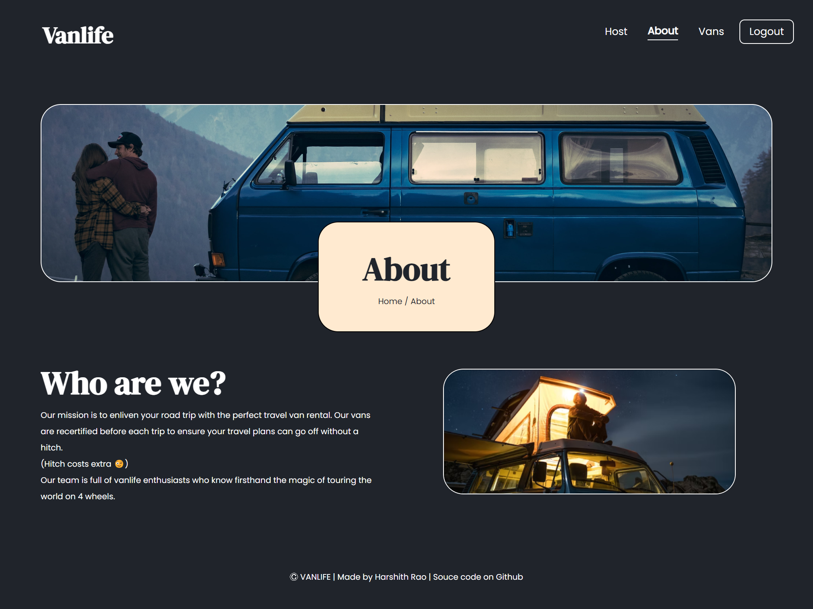
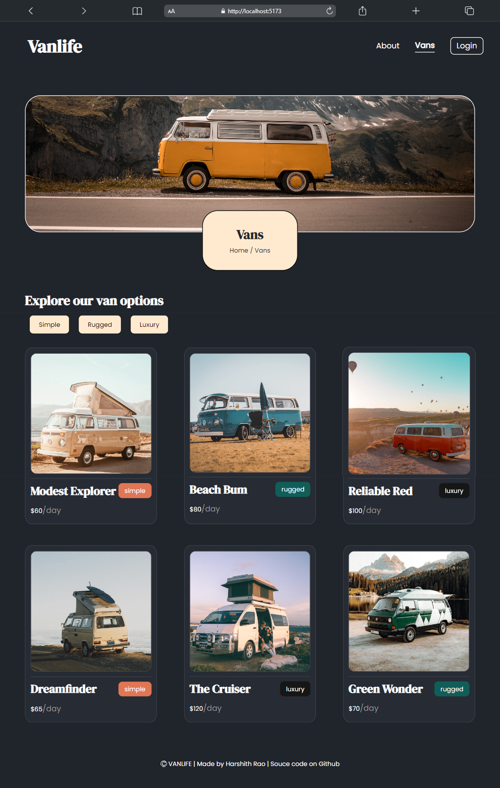
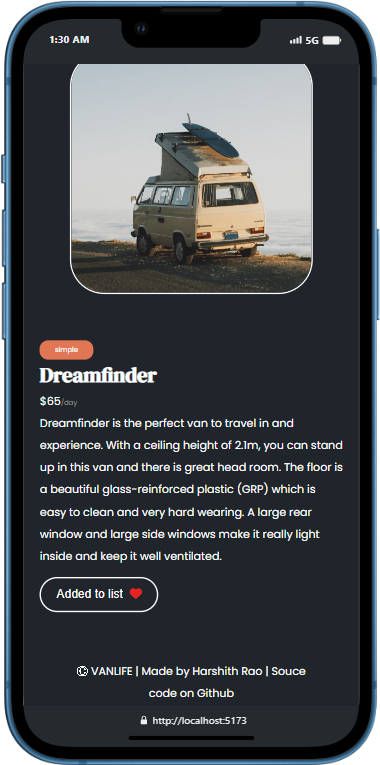
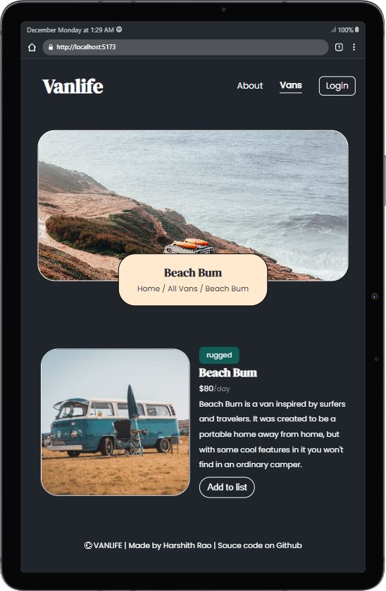

# Vanlife

Welcome to our user-friendly Van Rental App, designed with a strong emphasis on providing a seamless navigation experience and a polished interface to enhance overall usability. This application aims to simplify the process of renting vans while ensuring a delightful user experience.

## Live Site 

https://the-vanlife.netlify.app/

## Technologies Used

-React\
-React Router\
-Vite\
-Google Firebase (Both Firestore Database and Firebase Authentication)\
-Netlify\

## Key Features

-**Intuitive User Interface:** Our app boasts a clean and intuitive design, making it easy for users to navigate through various functionalities.

-**React Router Integration:** To ensure smooth navigation within the app, we have implemented React Router. This allows users to seamlessly move between different sections of the application without the need for full page reloads.

-**Firestore Database:** Data management is a critical aspect of our application, and we have leveraged Firestore Database for efficient and streamlined data storage. This ensures that user data is handled securely and efficiently.

-**Firebase Authentication:** Security is our priority. We have integrated Firebase Authentication to provide a secure login process, protecting user accounts and ensuring a trustworthy experience.

-**Vite Build Optimization:** To guarantee a robust and responsive application, we have utilized Vite for optimized build processes. This results in faster loading times and an overall improved performance.

-**Deployment on Netlify:** The application is deployed on Netlify, ensuring a reliable and scalable hosting environment. This enables us to provide a consistent and efficient service to our users.

## How to Run Locally

**Clone the repository:** git clone https://github.com/your-username/van-rental-app.git
**Install dependencies:** npm install
**Run the application:** npm run dev

## Screenshots

